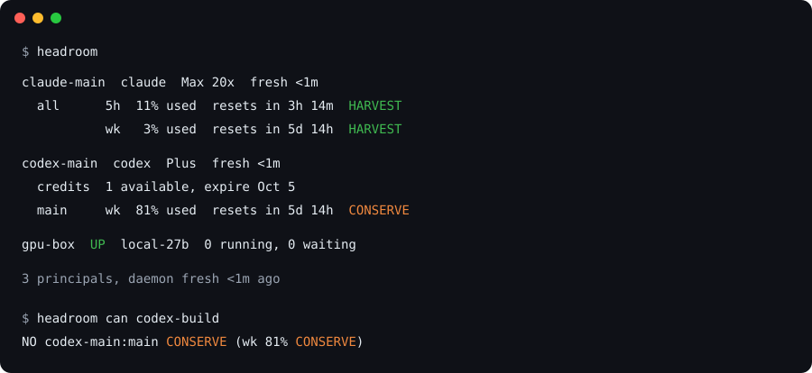
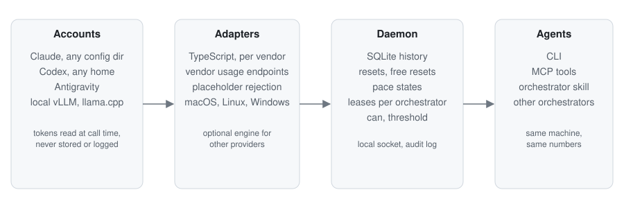

# Headroom

Headroom tells your agents how much of each AI subscription is left before they spend it.

One daemon reads the real meters of every account you own: Claude, Codex, Gemini through
Antigravity, and any number of accounts per vendor. It keeps history, notices resets and free
reset grants, and turns the numbers into a go or no-go an orchestrator can act on.



## The problem

Menu bar meters and log estimators show you the number. They don't answer the question an agent
has to ask before it fans out ten subagents: can this account afford the job right now, and if
not, who is next? Headroom answers that. When a reading is stale or failed it says UNKNOWN, and
UNKNOWN never counts as capacity.

## How it fits together

<picture>
  <source media="(prefers-color-scheme: dark)" srcset="docs/assets/headroom-flow-dark.svg">
  
</picture>

Headroom reads each vendor itself, in TypeScript, on macOS, Linux and Windows: the Claude Code
token from the Keychain or credentials file, the Codex token from its auth file, and Antigravity
from the daemon-kept `agy` session. The daemon keeps an `agy` pseudo-terminal alive so local
Antigravity quota summaries stay warm. The older remote Google OAuth path is deprecated and only
remains as a compatibility fallback for accounts whose Gemini Code Assist tier still serves it. Each call goes straight to the vendor's usage endpoint and the token is
dropped afterwards. The endpoint contracts were learned from
[CodexBar](https://github.com/steipete/codexbar) (MIT) by Peter Steinberger; an optional engine
links its library for providers Headroom does not cover natively.

## What you get

| | |
|---|---|
| Meters | One row per account and limit family: Claude `all`, `fable`, `routines`; Codex `main`, `spark`; Antigravity `gemini`, `claude-gpt`; local `capacity` |
| Pace | HARVEST, NORMAL, CONSERVE, FREEZE or UNKNOWN per window, from a straight line burn with a grace period after each reset |
| Memory | SQLite history plus `reset_seen`, `free_reset_granted`, `free_reset_used` and `source_failed` events, each with a confidence |
| Go or no-go | `headroom can <action>` checks every meter the action draws from. A frozen Fable meter blocks a Fable call even when the account has room overall |
| Surfaces | `headroom --json`, `headroom --threshold 90` (exit 2), a Unix socket daemon, an MCP server with `quota_status`, `quota_can`, `quota_events`, and a skill that tells an orchestrator how to use them |

Headroom is not a router. Which model is good at what is your opinion and changes monthly. Keep it
in `~/.headroom/routing.toml`; Headroom only filters your fallback list by budget. It also never sits in
the request path.

## Install

Not on npm yet. Until the first release, clone the repo, run `npm install && npm run build`, and
use `node dist/cli.js` where the commands below say `npx headroomd`.

```sh
npx headroomd engine install     # pin and verify the sensing engine
npx headroomd accounts discover  # find ~/.claude*, ~/.codex*, Antigravity
npx headroomd keychain grant     # macOS: one Claude Keychain prompt; choose Always Allow
npx headroomd                    # one line per meter
npx headroomd install-service    # launchd, systemd user unit, or Windows Task Scheduler
npx headroomd doctor             # one-line installation and daemon diagnostics
```

Register the MCP server in each Claude Code profile:

```sh
claude mcp add headroom -- npx headroomd mcp
CLAUDE_CONFIG_DIR=~/.claude2 claude mcp add headroom -- npx headroomd mcp
```

Codex and Gemini agents call the CLI. Copy `skills/headroom/SKILL.md` into your skills directory.

## Security

No secret touches disk or output. On macOS the signed `headroom-claude-probe` reads the Claude
Keychain token and makes the usage request itself, so the token never enters Node or stdout. Run
`headroom keychain grant` once and choose **Always Allow**; an updated probe binary prompts once
again. Tokens are otherwise read at call time from the Keychain or the
vendor's own credential file and dropped after the request. The daemon listens on a 0600 local
socket on macOS and Linux, or a current-user Windows named pipe. There is no telemetry, the engine
is pinned and checksum verified, and every query lands in an audit log. Details in [SECURITY.md](SECURITY.md).

## Status

Pre-alpha. Verified daily on one machine with two Claude config dirs, one Codex home, one
Antigravity account and two local inference boxes. Vendor endpoints are private and change
without notice; Headroom pins, records fixtures, backs off on 401, 403 and 429, and prints UNKNOWN
instead of a stale number. Google can reject the remote Antigravity fallback for unsupported
Gemini Code Assist tiers (for example `UNSUPPORTED_CLIENT`); keep the daemon running so its warm
`agy` source remains available.

MIT. Third party notices in [THIRD_PARTY_NOTICES.md](THIRD_PARTY_NOTICES.md).
