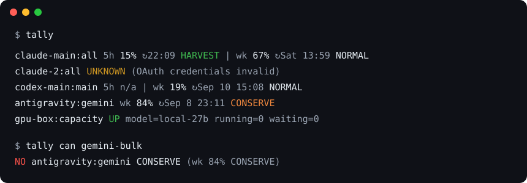
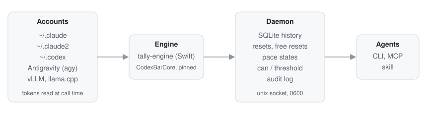

# Tally

Tally tells your agents how much of each AI subscription is left before they spend it.

One daemon reads the real meters of every account you own: Claude, Codex, Gemini through
Antigravity, and any number of accounts per vendor. It keeps history, notices resets and free
reset grants, and turns the numbers into a go or no-go an orchestrator can act on.



## The problem

Menu bar meters and log estimators show you the number. They don't answer the question an agent
has to ask before it fans out ten subagents: can this account afford the job right now, and if
not, who is next? Tally answers that. When a reading is stale or failed it says UNKNOWN, and
UNKNOWN never counts as capacity.

## How it fits together



Tally builds on [CodexBar](https://github.com/steipete/codexbar) (MIT) by Peter Steinberger.
The engine is a small Swift program that links CodexBarCore at a pinned tag and adds the one
thing the upstream CLI won't do: read Claude Code's Keychain item for every config dir. Two
Claude subscriptions on one Mac become two rows. Updating the engine is a tag bump and a fixture
run.

## What you get

| | |
|---|---|
| Meters | One row per account and limit family: Claude `all`, `fable`, `routines`; Codex `main`, `spark`; Antigravity `gemini`, `claude-gpt`; local `capacity` |
| Pace | HARVEST, NORMAL, CONSERVE, FREEZE or UNKNOWN per window, from a straight line burn with a grace period after each reset |
| Memory | SQLite history plus `reset_seen`, `free_reset_granted`, `free_reset_used` and `source_failed` events, each with a confidence |
| Go or no-go | `tally can <action>` checks every meter the action draws from. A frozen Fable meter blocks a Fable call even when the account has room overall |
| Surfaces | `tally --json`, `tally --threshold 90` (exit 2), a Unix socket daemon, an MCP server with `quota_status`, `quota_can`, `quota_events`, and a skill that tells an orchestrator how to use them |

Tally is not a router. Which model is good at what is your opinion and changes monthly. Keep it
in `~/.tally/routing.toml`; Tally only filters your fallback list by budget. It also never sits in
the request path.

## Install

```sh
npx keeptally engine install     # pin and verify the sensing engine
npx keeptally accounts discover  # find ~/.claude*, ~/.codex*, Antigravity
npx keeptally                    # one line per meter
npx keeptally install-service    # launchd or systemd unit for the daemon
```

Register the MCP server in each Claude Code profile:

```sh
claude mcp add tally -- npx keeptally mcp
CLAUDE_CONFIG_DIR=~/.claude2 claude mcp add tally -- npx keeptally mcp
```

Codex and Gemini agents call the CLI. Copy `skills/tally/SKILL.md` into your skills directory.

## Security

No secret touches disk or output. Tokens are read at call time from the macOS Keychain or the
vendor's own credential file and dropped after the request. The daemon listens on a local socket
with mode 0600, there is no telemetry, the engine is pinned and checksum verified, and every
query lands in an audit log. Details in [SECURITY.md](SECURITY.md).

## Status

Pre-alpha. Verified daily on one machine with two Claude config dirs, one Codex home, one
Antigravity account and two local inference boxes. Vendor endpoints are private and change
without notice; Tally pins, records fixtures, backs off on 401, 403 and 429, and prints UNKNOWN
instead of a stale number.

MIT. Third party notices in [THIRD_PARTY_NOTICES.md](THIRD_PARTY_NOTICES.md).
