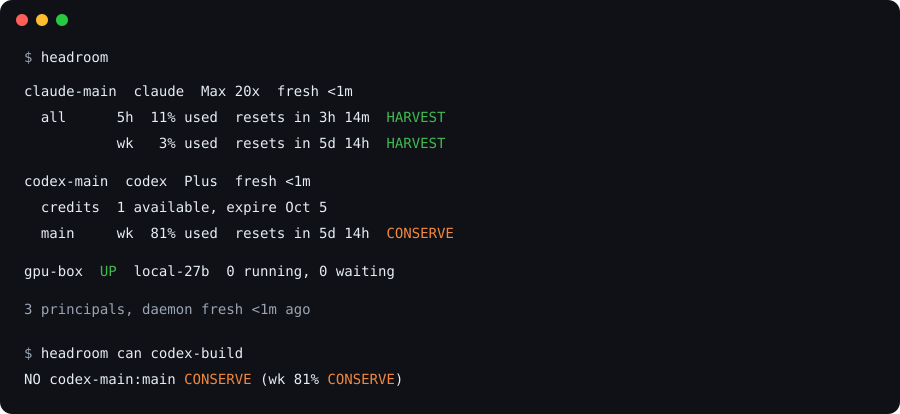
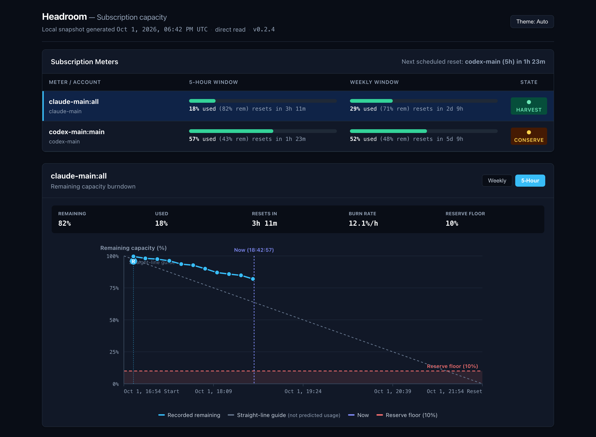
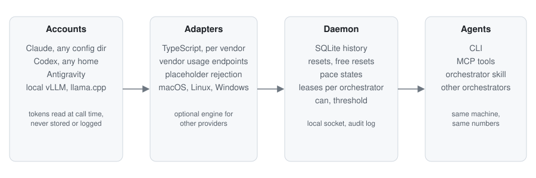

<p align="center">
  <picture>
    <source media="(prefers-color-scheme: dark)" srcset="docs/assets/banner-dark.svg">
    
  </picture>
</p>

<p align="center">
  <b>Coding agents ask Headroom before they start work and get go, wait or reroute, from the limits your AI subscriptions report. They ask through the CLI or MCP in Claude Code, so you stop babysitting usage meters and reset times.</b>
</p>

<p align="center">
  <a href="https://github.com/Apertur3/headroom/actions/workflows/ci.yml"></a>
  <a href="https://www.npmjs.com/package/headroomd"></a>
  <a href="https://github.com/Apertur3/headroom/blob/master/package.json"></a>
  
  <a href="LICENSE"></a>
</p>

<p align="center">
  <a href="#install"><b>Install</b></a> &nbsp;&middot;&nbsp;
  <a href="#for-agents"><b>For agents</b></a> &nbsp;&middot;&nbsp;
  <a href="#why"><b>Why</b></a> &nbsp;&middot;&nbsp;
  <a href="#demo"><b>Demo</b></a> &nbsp;&middot;&nbsp;
  <a href="#design-principles"><b>Design principles</b></a> &nbsp;&middot;&nbsp;
  <a href="#documentation"><b>Docs</b></a>
</p>

<table align="center">
  <tr>
    <td align="center"><b>7</b><br><sub>sources read</sub></td>
    <td align="center"><b>3</b><br><sub>OSes tested in CI</sub></td>
    <td align="center"><b>1</b><br><sub>local daemon, one call per decision</sub></td>
    <td align="center"><b>0</b><br><sub>telemetry (one opt-out update check)</sub></td>
  </tr>
</table>

<p align="center">
  <sub>Sources: five subscription services (Claude, Codex, Kimi, and the experimental Antigravity and Grok) and two local server types (vLLM and llama.cpp). A stale or failed reading prints <b>UNKNOWN</b>, never a number. <a href="docs/verification.md">Full writeup</a> &middot; <a href="docs/verification.md#reproduce-it">Reproduce it</a></sub>
</p>

<p align="center"><sub>Independent open source project, not affiliated with, sponsored by or endorsed by Anthropic, OpenAI, Google, xAI or Moonshot AI. Several integrations use undocumented vendor endpoints with your own login: see <a href="#vendor-endpoints-and-your-accounts">Vendor endpoints and your accounts</a>. Claude, Codex, Antigravity, Grok and Kimi are trademarks of their respective owners, used here only to name the services Headroom reads. This is the npm package <code>headroomd</code> (repository Apertur3/headroom), not related to other projects named Headroom such as the context-compression library headroomlabs-ai/headroom.</sub></p>

---

## Demo

<p align="center">
  
</p>

<p align="center"><sub>Synthetic data. The terminal runs the real CLI against a mock home, generated by <a href="scripts/render-demo-animated.mjs"><code>scripts/render-demo-animated.mjs</code></a>.</sub></p>

---

## Install

Node 22.13 or newer. The npm package is `headroomd`; the Homebrew formula is
`apertur3/tap/headroom`. Both install the `headroom` command.

```sh
npm install -g headroomd
# or, on macOS and Linux: brew install apertur3/tap/headroom
# finds your logins, runs the doctor, asks before each change
headroom setup
# one block per account: percent used, reset time and pace state per window
headroom
```

Already running Claude Code or another agent? Copy [skills/headroom/SKILL.md](skills/headroom/SKILL.md) into its skills directory and say "set up headroom".

`headroom setup` offers to register the MCP server for your default Claude Code profile. To
register it by hand, or in another profile:

```sh
claude mcp add --scope user headroom -- headroom mcp
CLAUDE_CONFIG_DIR=~/.claude2 claude mcp add --scope user headroom -- headroom mcp
```

Agents without MCP, Codex for example, call the CLI. Then give your agents the instructions in
[For agents](#for-agents). The MCP tools and example calls are in
[docs/mcp-and-agents.md](docs/mcp-and-agents.md).

<details>
<summary>Manual setup and optional configuration</summary>

The three commands above are the short path. Discovery on its own:

```sh
headroom accounts discover   # finds Claude, Codex, Antigravity, Grok and Kimi logins
```

On macOS and Linux, `brew install apertur3/tap/headroom` installs the same package and adds a
`brew services start headroom` service.

By hand, the same steps are one command:

```sh
headroom setup                # discovery, doctor, service, MCP registration -- asks before each change
```

Run `headroom notify configure` to choose notification channels, a preset and overrides. Run
`headroom update` only when you choose to install a newer package; `headroom uninstall` reverses
setup, and `headroom completion <bash|zsh|fish|pwsh>` prints a shell completion script.

`accounts discover` prints what it wrote (`Wrote ~/.headroom/accounts.toml (4 accounts). Next: headroom
doctor`) and, the first time, seeds `~/.headroom/policy.toml` and `routing.toml` from `examples/` so
`headroom can <class> --owner <your-agent-name>` works immediately with the example action classes (`claude-fable`, `codex-build`,
`gemini-bulk`) -- edit `routing.toml` to match your accounts.

Keep an optional second profile that is deliberately logged out without polling it: add
`enabled = false` to its `[[accounts]]` block, or run `headroom accounts disable <name>`.
It remains configured and can be restored with `headroom accounts enable <name>`.

Full walkthrough, including what each step grants and why: [docs/quickstart.md](docs/quickstart.md).

`status`/`doctor` check the npm registry at most once a day (a plain GET of the `headroomd`
version, no account data) and print a one-line notice when a newer `headroomd` is out; run
`headroom update` (never automatic) to install it. Set `update_check = false` in
`~/.headroom/policy.toml` to turn the check off -- see
[Staying up to date](docs/quickstart.md#staying-up-to-date).

</details>

---

## For agents

Paste this into the `CLAUDE.md` or `AGENTS.md` your agents read, and replace the placeholders with
your own action classes, meters and agent name. The agent then checks Headroom before it dispatches
work, instead of asking you.

```markdown
## Usage limits (Headroom)

Check Headroom before you start work on a subscription. Do not ask me about usage or reset times.

- `headroom can <class> --owner <your-name>`: exit 0 means go, exit 2 means no. Any other exit
  is an error: treat it as no. Classes are the `[consumes]` entries in `~/.headroom/routing.toml`.
- On no, try the next class in your fallback list. If none has room, run
  `headroom wait --meter <meter> --until-reset --max 6h` (exit 3 means it timed out), then run
  `headroom can` again before you start anything.
- Start a job with
  `headroom run --meter <meter> --need <window>:<points> --owner <your-name> -- <command>`,
  for example `--need 5h:10` for 10 percent of the 5-hour window. It reserves the points, runs
  the command and releases them when it exits. Exit 2 means refused; otherwise it returns the
  command's own exit code.
- UNKNOWN means there is no trustworthy reading. Treat it as no. Never pass `--allow-unknown`
  unless I ask for it.
- For the full picture, read `headroom --json`, not the human view.
- In Claude Code with the Headroom MCP server, `quota_can` answers the same question as
  `headroom can`.
```

A plain `can` is advisory. A reservation tells other agents that use Headroom the points are taken;
it does not limit what the job itself spends, and it cannot stop tools that do not use Headroom.
The longer version, with pace states, leases and reserves, is
[skills/headroom/SKILL.md](skills/headroom/SKILL.md).

---

## Platform support and known limitations

| Platform | Status |
|---|---|
| macOS | The primary platform: daily use on one machine, plus CI. Antigravity needs macOS 14 or later |
| Linux | CI on Ubuntu; cold install also checked by hand on ARM64 |
| Windows | **Experimental.** Tests run in CI and 0.2.4 was installed on a Windows 11 machine. Reading a real Claude login, MCP registration and the process watchdog are not verified, and the service fix in [#110](https://github.com/Apertur3/headroom/pull/110) is not re-verified on a real machine. Full detail below |
| Antigravity | Experimental. Depends on a private local endpoint that the vendor can change |
| Grok | Experimental. Reads the Grok CLI's undocumented chat-proxy endpoint and presents itself as the Grok CLI |

<details>
<summary>The full table: tests, CI, install checks, Windows, vendor endpoints</summary>

| | |
|---|---|
| Tests | `npm test` (vitest), run on every push on macOS, Ubuntu and Windows; some tests are POSIX-only and skip on Windows. Current counts are in the CI logs; method and limits: [docs/verification.md](docs/verification.md) |
| CI platforms | macOS, Ubuntu and Windows (`macos-latest`, `ubuntu-latest`, `windows-latest`): lint, tests, build, `npm pack --dry-run`, privacy sweep, `npm audit` |
| Daily use | one macOS machine; this is the only environment a person uses every day |
| Install from the packed tarball | scripted cold-install smoke test ([`smoke-cold.sh`](scripts/smoke-cold.sh)) runs in the release workflow; also checked by hand on macOS and on Linux ARM64 |
| Windows | **experimental.** Version 0.2.4 was installed from the npm registry on a Windows 11 machine, and these worked: install, `accounts discover`, `doctor`, `status` / `can` / `gate` / `dashboard` (UNKNOWN, never a fake number), HTML report permissions, the daemon on a named pipe, `uninstall`. Not verified: reading a real Claude login, MCP registration, and the process watchdog (inactive on Windows). Starting the background service failed on 0.2.4 (`install-service` wrote the task XML in the wrong encoding); the fix is in [#110](https://github.com/Apertur3/headroom/pull/110) and has not been re-verified on a real machine. PowerShell's default execution policy blocks the `npm` and `headroom` `.ps1` shims; use `cmd`, or relax the policy |
| Works with | Claude Code through MCP (registered with `claude mcp add`, covered by [`mcp-registration.test.ts`](test/mcp-registration.test.ts) and [`daemon-mcp.test.ts`](test/daemon-mcp.test.ts)); any agent that can run a shell command, through the CLI and `--json`. Other MCP clients: untested |
| Antigravity | experimental; macOS 14 or later only, and it depends on a private local endpoint that the vendor can change |
| Vendor endpoints | private and unversioned. Headroom pins them, records redacted fixtures and prints UNKNOWN when a shape changes, but it cannot promise they keep working |

</details>

---

## Why

An agent that fans out several jobs needs two answers first: can this account afford them, and
which other jobs have already reserved capacity? Vendor screens answer neither for a program, and
a stale reading can send more work to an account that no longer has capacity. Headroom combines
vendor readings with cooperative reservations. When a reading is stale or failed it says UNKNOWN
instead of a number, and `can` answers NO for it unless you pass `--allow-unknown`.

One daemon reads quota across Claude, Codex, Antigravity, Grok, Kimi, and local vLLM or llama.cpp
pools, keeps history, and detects resets. Antigravity and Grok support is experimental.

<p align="center">
  
</p>

### How it differs from a usage analyzer

Usage analyzers such as [ccusage](https://github.com/ccusage/ccusage) read local usage files and
report estimated costs. Headroom reads the usage and limits your vendors report, from their own
usage endpoints, and answers before work starts: `can`, `gate`, `route`, leases and an inbox, for
agents that dispatch work. They answer different questions and work side by side.

---

## Before and after

Without a check, an agent finds the limit by hitting it, in the middle of a task. With Headroom it
checks first and tries the next class in your fallback list when the answer is NO. `can` only
checks; when several jobs start at once, use `headroom run` so each one reserves its capacity.

**Without Headroom**

```sh
# weekly limit reached mid-task, work stops half done
codex exec "refactor the billing module"
```

**With Headroom**

```sh
if headroom can codex-build --owner builder; then
  codex exec "refactor the billing module"
elif headroom can claude-fable --owner builder; then
  claude -p "refactor the billing module"
else
  # no class has room: wait for a reset, then check again before dispatching
  headroom wait --meter codex-main:main --until-reset --max 6h
fi
```

`headroom run --meter ... --need ... --owner ... -- <command>` goes one step further: it checks,
reserves the capacity for the job's duration so other agents that use Headroom see it as taken,
runs the command, and releases the reservation. Runnable examples against synthetic data are in [`examples/`](examples).

---

## Features

<table>
<tr>
<td width="33%" valign="top"><b>Reads real limits</b><br>Subscription usage and limits as Claude, Codex, Antigravity, Grok and Kimi report them, plus availability and load for local vLLM or llama.cpp pools.</td>
<td width="33%" valign="top"><b>Pace, not just percent</b><br>HARVEST, NORMAL, CONSERVE, FREEZE or UNKNOWN per window, from a straight line burn with a grace period after each reset.</td>
<td width="33%" valign="top"><b>Go, wait or reroute</b><br><code>can</code>, <code>gate</code>, <code>route</code>, <code>plan</code>, <code>fill</code> and <code>wait</code> answer before the job starts.</td>
</tr>
<tr>
<td valign="top"><b>Reservations</b><br>Leases and per-meter reserves coordinate capacity among agents that use Headroom (<code>run</code>, <code>can --lease</code>).</td>
<td valign="top"><b>Fails closed</b><br>A stale or failed reading prints UNKNOWN, never a number. By default, <code>can</code> answers NO for it.</td>
<td valign="top"><b>Local only</b><br>A daemon on a 0600 socket (a named pipe on Windows), Headroom's own secrets in the OS store, no telemetry. The CLI checks npm for a newer version at most once a day; turn it off with <code>update_check = false</code>.</td>
</tr>
</table>

<table>
<tr>
<td><b>Reads</b></td>
<td>Claude &middot; Codex &middot; Antigravity (experimental) &middot; Grok (experimental) &middot; Kimi &middot; local vLLM &middot; local llama.cpp</td>
</tr>
<tr>
<td><b>Called from</b></td>
<td>Claude Code through MCP (<a href="test/mcp-registration.test.ts">tested</a>); any agent that can run a shell command, through the CLI and <code>--json</code>. Other MCP clients: untested.</td>
</tr>
</table>

<details>
<summary>Everything it ships</summary>

| | |
|---|---|
| Vendors and meters | Claude `all`, `fable`, `routines` and reported scoped meters; Codex `main`, `spark`, `credits`; Antigravity `gemini`, `claude-gpt`; Grok, Kimi; and local vLLM or llama.cpp `capacity` pools |
| Pace | HARVEST, NORMAL, CONSERVE, FREEZE or UNKNOWN per window, from a straight line burn with a grace period after each reset |
| Decisions | `can`, `gate`, `route`, `plan`, `fill`, `wait`, leases, per-meter reserves, and a spend ledger coordinate shared capacity and pacing |
| Views and automation | Terminal status, `dashboard`/`top` (and `--html <path>` browser report), `statusline --render`, `usage --paste` or `--clipboard`, JSON contract output, local daemon, and MCP tools |
| Operations | Interactive `setup`; the `notify configure` picker with calm, quiet and everything presets; `inbox`; `export` as JSON or CSV; `doctor --bundle`; `update`; `uninstall`; and shell `completion` |

Headroom is not a router. Which model is good at what is your opinion and changes monthly. Keep it
in `~/.headroom/routing.toml`; Headroom only filters your fallback list by budget. It also never sits in
the request path.

</details>

---

## Dashboard



<sub>Synthetic data, generated by [`scripts/render-dashboard-demo.mjs`](scripts/render-dashboard-demo.mjs).</sub>

### Human dashboard and browser report

Open the terminal overview, or export a local browser snapshot:

```sh
headroom dashboard
headroom dashboard --once --ascii
```

Use Tab to select a meter, `v` for details, and `e` for events. Both chart views show
recorded remaining capacity, with gaps where readings are missing or untrusted.

To open the same recorded history in a browser:

```sh
headroom dashboard --html report.html
```

Open the generated file in your browser. The report shows subscription usage and reset times in an overview, with selectable window charts and sample details. It supports light and dark themes and makes no external requests. It is a snapshot: generate it again for newer readings. Existing files are preserved unless you pass `--force`; new files use mode 0600 on systems that support Unix permissions.

---

## Design principles

Each of these is a rule the code enforces and a test pins. Past real-world breakage is the reason for every one.

- **Fail closed: never a fake number.** A missing, stale or inconsistent reading becomes UNKNOWN, and `can` answers NO for it unless you explicitly pass `--allow-unknown`.
- **A stale-lane canary that cannot be silenced.** A lane with no fresh reading for 6 hours raises an alert, whatever the notification config says.
- **Only kill what Headroom provably started.** On macOS and Linux, a process is signalled only if its recorded pid, command and start time still match.
- **Secrets stay in their own stores.** Notification tokens live in the OS secret store; vendor credentials are read at use time from the vendor's own store or credential file and never copied. Output is redacted.
- **A redacted fixture per past breakage.** Every Antigravity failure shape seen in the field has a fixture and a test.

<details>
<summary>Where each one is enforced and tested</summary>

- **Fail closed: never a fake number.** A missing, stale, held or inconsistent reading becomes
  UNKNOWN, and `can` answers NO for it unless you pass `--allow-unknown`
  ([`freshnessGate`, `canConsume`](src/policy.ts), tested in
  [`store-policy.test.ts`](test/store-policy.test.ts)). Antigravity lanes that report no usage are
  classified as blocked, idle or unknown, never filled in
  ([`antigravity-lanes.ts`](src/antigravity-lanes.ts),
  [`antigravity-lane-classifier.test.ts`](test/antigravity-lane-classifier.test.ts)).
- **A stale-lane canary that cannot be silenced and does not spam humans.** A meter lane with no
  fresh reading for 6 hours (configurable) raises an alert into the inbox and `headroom doctor`.
  It runs before and independently of the notification config, so a muted channel or
  `events_off` cannot hide it. External channels get nothing per lane; at most one plain-language
  message per principal per episode, after 24 hours, held during quiet hours
  ([`canary.ts`](src/canary.ts), [`stale-lane-canary.test.ts`](test/stale-lane-canary.test.ts)).
- **Process hygiene: only kill what Headroom provably started.** A process is signalled only if
  recorded evidence (pid, command and start time from when Headroom launched it) still matches
  the live process, re-checked immediately before every signal, so a recycled pid is never hit.
  An age watchdog reaps Headroom-started `agy` processes that outlive their limit
  ([`process-tree.ts`](src/process-tree.ts), [`agy-watchdog.ts`](src/agy-watchdog.ts),
  [`antigravity-keepalive-stop-recycled-pid.test.ts`](test/antigravity-keepalive-stop-recycled-pid.test.ts),
  [`agy-watchdog.test.ts`](test/agy-watchdog.test.ts)). The test suite itself fails if any
  process it started outlives the run ([`global-leak-gate.ts`](test/global-leak-gate.ts)). The
  watchdog and the pid and start-time checks are not active on Windows.
- **Secrets stay in their own stores.** Headroom's own credentials (notification tokens) are
  read at use time from the macOS Keychain (`secret-tool` on Linux, Credential Manager on
  Windows) and never written to disk; vendor tokens are read at call time from the vendor's own
  store or credential file (for Kimi's manual token and the Moonshot key, a 0600 file you save
  yourself) and dropped. Output and logs are redacted
  ([`notify.ts`](src/notify.ts), [`security.ts`](src/security.ts),
  [`security.test.ts`](test/security.test.ts), [SECURITY.md](SECURITY.md)).
- **A redacted fixture per past breakage.** Every Antigravity failure shape seen in the field
  has a fixture (recorded and redacted, or synthetic) and a test that runs it through the real
  code path ([`test/fixtures/antigravity/`](test/fixtures/antigravity),
  [`record-antigravity-fixture.sh`](scripts/record-antigravity-fixture.sh)). The repo
  also scans itself and its packed npm tarball for private addresses, emails and home paths
  ([`privacy-sweep.sh`](scripts/privacy-sweep.sh), run in CI).

</details>

---

## How it fits together

<picture>
  <source media="(prefers-color-scheme: dark)" srcset="docs/assets/headroom-flow-dark.svg">
  
</picture>

Headroom reads Claude, Codex, Grok and Kimi through native TypeScript adapters.
Antigravity is experimental and supported on macOS 14 or later: it requires a logged-in
`agy` and a running Headroom daemon. The npm and Homebrew packages include a universal
macOS reader, verified by SHA-256 before use. Gemini CLI is not required or supported for consumer subscriptions;
[Google ended consumer Gemini CLI access on June 18, 2026](https://developers.googleblog.com/an-important-update-transitioning-gemini-cli-to-antigravity-cli/).

For Antigravity quota, the bundled macOS reader finds the running Antigravity language server
(the daemon-kept `agy`) in the process list, takes its local port and, where the process has one,
the local CSRF token from its command line, and asks that server on 127.0.0.1 for its quota
summary. It does not read agy's OAuth or session credential. The daemon also reads the tail of
agy's newest log under `~/.gemini/antigravity-cli/log` for login-state markers only. The optional
Antigravity model-list check is off by default and is the one path that uses the Gemini CLI's
OAuth file; see [Vendor endpoints and your accounts](#vendor-endpoints-and-your-accounts).
Missing or failed summaries stay UNKNOWN. An idle window with real fractions may carry
a doubt marker when its reset time looks synthetic. A five-hour window entirely absent
from an otherwise-successful response (a genuinely idle rolling window) prints `n/a`
instead of UNKNOWN and does not block a budget check. The endpoint contracts and native
reader build on [CodexBar](https://github.com/steipete/codexbar) (MIT).

### A budget check before a job

This synthetic example has 20% usage and another owner reserving 75%. The remaining capacity
cannot cover another 10-point job, so the child command never starts:

```text
$ headroom run --meter claude-main:all --need wk:10 --owner builder -- codex exec "Run the tests"
wk needs 10 more but only 0.0 left after 75.0% already leased before the 10% reserve
```

When there is enough capacity, `run` reserves it, starts the command, and releases the reservation
when it finishes. The check and reservation are atomic across processes. A plain `can` or `gate`
is advisory; use `run` or `can --lease` when starting work. These reservations coordinate agents
that use Headroom; they cannot stop unrelated tools from consuming the subscription.

### Examples

Runnable against synthetic data, no logins needed. Build once, then point the CLI at a seeded home:

```sh
npm run build
# sets HEADROOM_HOME to a throwaway demo home
eval "$(node scripts/demo-home.mjs)"
# walks a fallback list, dispatches on the first class with room
bash examples/orchestrator-loop.sh
# refuses a job the budget cannot cover (exit 1)
bash examples/ci-gate.sh
# the MCP call a client sends, over stdio
bash examples/mcp-quota-can.sh
```

The scripts refuse to run unless `HEADROOM_HOME` points at that demo home, so they cannot touch a real
`~/.headroom`, and they call the repo build (`dist/cli.js`), not a global `headroom`. They print which
binary they use.

See [`examples/`](examples) for the scripts and the starter `accounts.toml`, `policy.toml` and
`routing.toml`.

---

## Documentation

- [docs/quickstart.md](docs/quickstart.md): install to first truthful line, macOS, Linux and Windows
- [docs/concepts.md](docs/concepts.md): principal, meter, window, observation, pace states, leases, events
- [docs/mcp-and-agents.md](docs/mcp-and-agents.md): the MCP tools, example calls, and how an orchestrator should use them
- [docs/json-contract.md](docs/json-contract.md): the versioned field-by-field shape of every `--json` output and MCP tool result, and its compatibility promise
- [docs/vendors.md](docs/vendors.md): what Headroom reads per vendor, and its known live limitations

## Vendor endpoints and your accounts

Several adapters read usage endpoints that the vendors do not document as public APIs. Headroom
calls them with your own credentials, taken from the vendor CLIs you installed and signed in to on
the same machine, and only to read usage: it sends no prompts, changes no account settings, and
never writes to another tool's credential store. Use it only with accounts you own. Vendor terms
may restrict this kind of access, and a vendor can change or block an endpoint at any time; use it
at your own risk. Headroom does not rotate credentials to get past a block or a limit.

| Source | What Headroom calls | Credential | Documented by the vendor |
|---|---|---|---|
| Claude, statusline snapshot (preferred) | No network call: reads the JSON Claude Code passes to its `statusLine` command | None | Not applicable (local) |
| Claude, usage probe | `GET api.anthropic.com/api/oauth/usage` | Claude Code's OAuth token, from the macOS Keychain or `.credentials.json` | No. Sends `User-Agent: claude-code/2.1.0` |
| Codex | `GET chatgpt.com/backend-api/wham/usage` and `.../wham/rate-limit-reset-credits`; also the Codex CLI's local session logs | ChatGPT token in `~/.codex/auth.json` | No. Sends `User-Agent: CodexBar`; the credits call also sends `originator: Codex Desktop` |
| Antigravity quota (experimental) | agy's local language server on 127.0.0.1 | agy's local CSRF token from its process command line, where present; not agy's OAuth or session credential | No (private local endpoint) |
| Antigravity model list (experimental, off by default) | `cloudcode-pa.googleapis.com/v1internal:loadCodeAssist` and `:fetchAvailableModels`, at most hourly | The Gemini CLI's OAuth file `~/.gemini/oauth_creds.json`; an expired token is refreshed in memory at `oauth2.googleapis.com` with the OAuth client found in the installed Gemini CLI, never written back | No. Sends `User-Agent: antigravity` and `ideType: ANTIGRAVITY`. Enable only with `antigravity_model_catalog = true` in `policy.toml` |
| Grok (experimental) | `GET cli-chat-proxy.grok.com/v1/billing?format=credits` and `/v1/settings` | Bearer token from `~/.grok/auth.json` (written by `grok login`) | No. Sends `x-xai-token-auth: xai-grok-cli`, the value the Grok CLI sends, so the request presents itself as the Grok CLI |
| Kimi, CLI credential | `GET api.kimi.com/coding/v1/usages` | Access token from `~/.kimi-code/credentials/kimi-code.json` | No. Sends `x-msh-platform: kimi_code_cli` |
| Kimi, manual token | The `www.kimi.com/apiv2` web gateway | A `kimi-auth` web session token you save yourself to a 0600 file (default `~/.kimi/auth.token`) | No |
| Kimi, optional balance | `GET api.moonshot.ai/v1/users/me/balance` | A Moonshot API key you save to a 0600 `moonshot.key` file | Yes (Moonshot platform API) |
| Local vLLM, llama.cpp | Your own server at the `base_url` you configure | None from a vendor | Not applicable |

Per-vendor detail: [docs/vendors.md](docs/vendors.md).

## Security

Headroom never writes a vendor credential or notification token to disk, and redacts secrets from
its output. On macOS a bundled helper, `headroom-claude-probe`, reads Claude Code's Keychain token
by running `/usr/bin/security`, which the Keychain item's own access list admits, keeps it in the
helper's memory and makes the usage request itself, so the token never reaches Node or Headroom's
output. With Claude Code 2.1.263 on macOS 26.5 this needed no Keychain dialog. The helper ships
inside the npm package as a universal binary, verified against a recorded SHA-256 before every use.
Tokens are otherwise read at call time from the vendor's own credential file and dropped after the
request. The daemon listens on a 0600 local socket on macOS and Linux. On Windows it uses a named
pipe where both sides prove they hold a per-daemon session token, kept in a 0600 file under
`HEADROOM_HOME`. There is no telemetry. Apart from
the vendors you configure and the notification channels you enable, the only request Headroom
makes unprompted is the daily npm version check above, a plain GET with no account data
(`update_check = false` turns it off); `headroom update` and `headroom engine install` contact npm
and GitHub only when you run them. The engine is pinned and checksum verified, and every query
lands in an audit log. Details in [SECURITY.md](SECURITY.md).


## Status

Releases are published to npm as `headroomd`; [CHANGELOG.md](CHANGELOG.md) lists what changed in
each one. Vendor endpoints are private and
change without notice: Headroom pins them, records fixtures, backs off on 401, 403 and 429, and
prints UNKNOWN instead of a stale number. What is and is not verified is in
[Platform support and known limitations](#platform-support-and-known-limitations). Antigravity requires macOS and a daemon-kept `agy`; see
[vendor setup](docs/vendors.md#antigravity).

Contributions are welcome: see [CONTRIBUTING.md](CONTRIBUTING.md) and the issues labelled
[good first issue](https://github.com/Apertur3/headroom/labels/good%20first%20issue).

MIT. Third party notices in [THIRD_PARTY_NOTICES.md](THIRD_PARTY_NOTICES.md).
